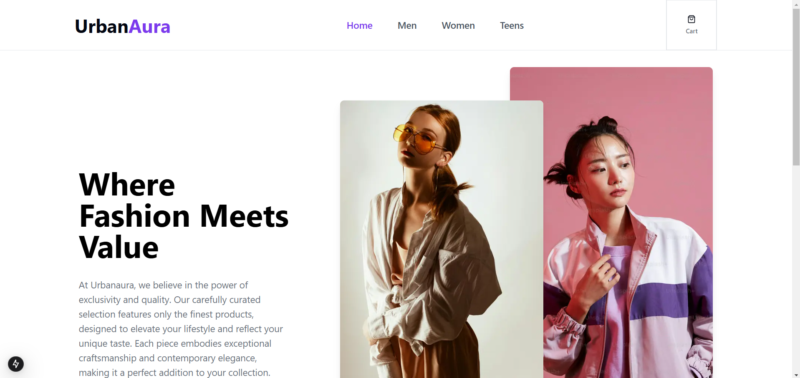
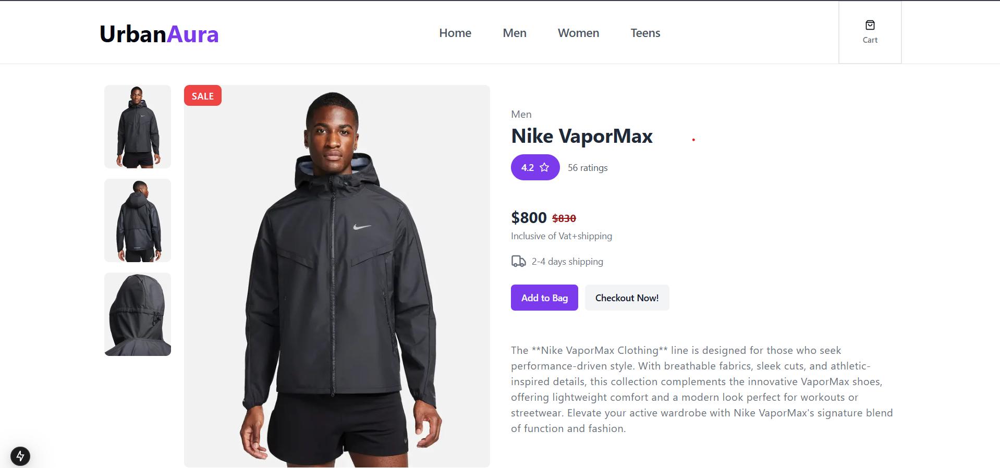

# Urbanaura

Welcome to **Urbanaura**! This is a modern e-commerce website built with Next.js 15, TypeScript, Tailwind CSS, Sanity.io for content management, and Stripe for secure payment processing.

## Features

- **Responsive Design**: Optimized for both desktop and mobile users.
- **Dynamic Content**: Manage products and content easily with Sanity.io.
- **Secure Payments**: Integration with Stripe for hassle-free transactions.
- **Fast Performance**: Built on Next.js for optimal speed and SEO.
- **Type Safety**: Utilize TypeScript for improved developer experience and fewer runtime errors.

## Tech Stack

- **Next.js**: A React framework for server-side rendering and static site generation.
- **TypeScript**: A typed superset of JavaScript that compiles to plain JavaScript.
- **Tailwind CSS**: A utility-first CSS framework for rapid UI development.
- **Sanity.io**: A headless CMS for managing content and products.
- **Stripe**: Payment processing platform for handling transactions securely.

##Screenshots

